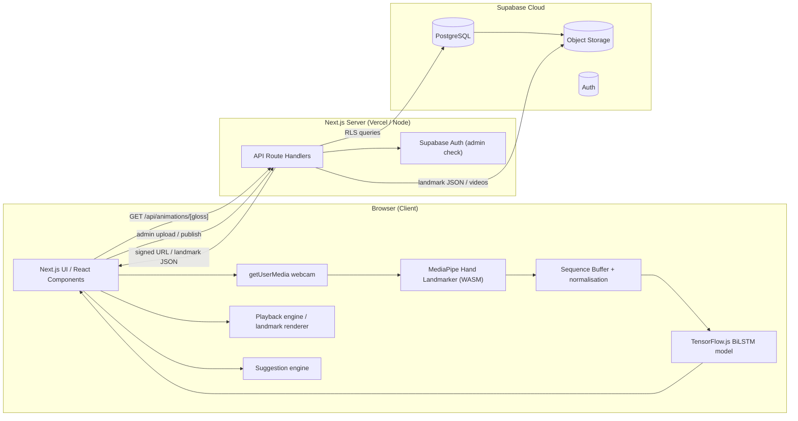
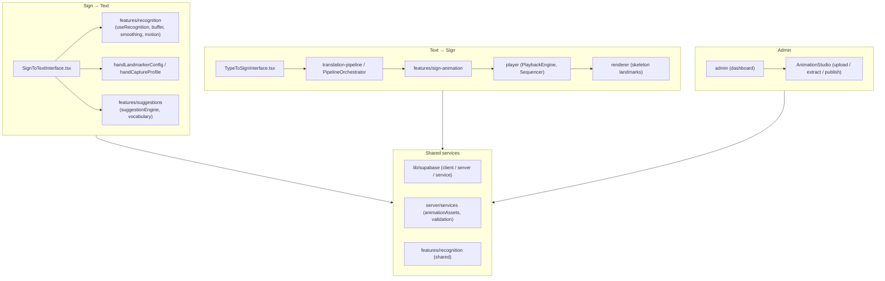
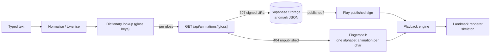
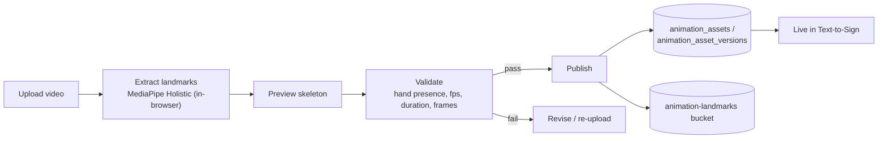
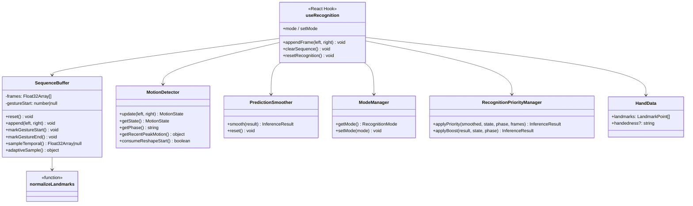
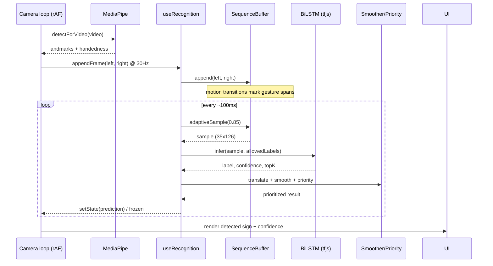
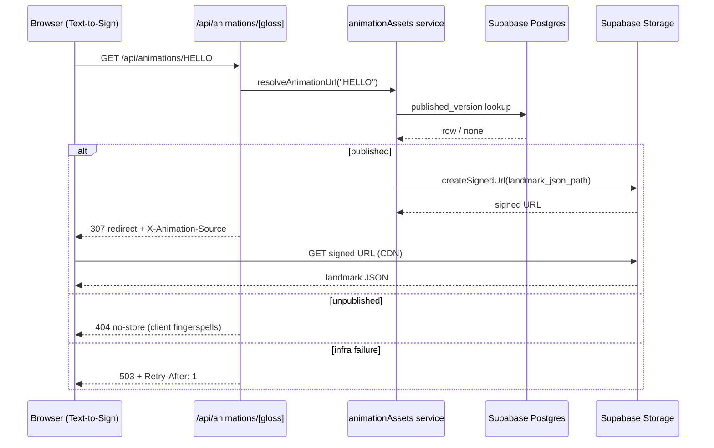
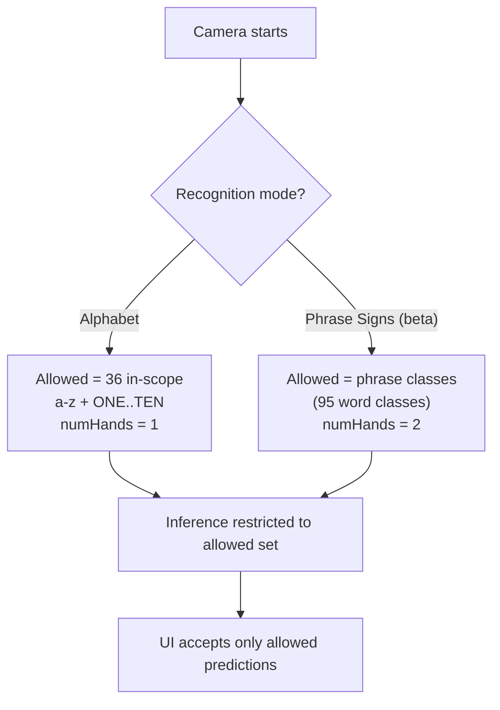

# SignLangVisual — Complete System Documentation

> One-file reference for the whole system: architecture, algorithms, database,
> backend, API, data flow, UML and flowcharts.
>
> Status: reflects the current source of truth in this repository.

---

## 1. Overview

**SignLangVisual** is an AI-assisted **Filipino Sign Language (FSL) translation
system**. It provides two directions:

| Direction | Route | What it does |
|---|---|---|
| **Sign → Text** | `/translate` | Recognises letters (`a`–`z`) and numbers (`ONE`–`TEN`) from a live webcam, builds words, and suggests dictionary words. A separate **Phrase Signs** mode (beta) covers the 95 phrase glosses. |
| **Text → Sign** | `/translate` | Plays typed text back as sign animations — a published sign if one exists, otherwise automatic fingerspelling using published alphabet animations. |

Two supporting public routes: **`/learn`** (FSL reference — alphabet, numbers,
tutorials) and **`/evaluation`** (accuracy harness over all 131 classes).

**Numbers are `ONE`–`TEN`. There is no `ZERO` class.** Text-to-Sign can render a
`0` animation (assets cover `0`–`10`), but Sign-to-Text can never recognise one.

The `0` asset is therefore an **orphan by design, not a defect**: it has no
model class, and both halves of that are deliberate. Rendering a zero when
someone types one is useful; recognising one is a model limitation. Do not
"fix" it by deleting the asset, and do not reason about recognisable classes
from the published asset list — the `0`–`9` UI bug came from exactly that
mistake. The label list is the authority on what can be recognised.

### 1.1 Animation coverage

Denominator is the deployed `bilstm_v4` label count (131 = 26 letters `a`–`z` +
10 numbers `ONE`–`TEN` + 95 phrases). Figures as published (batch completed 2026-08-18: 91 signs, 0 failures):

| | |
|---|---|
| Assets published | 130 |
| — mapping to a model class | 129 |
| — orphan (`0`, no `ZERO` class) | 1 |
| **Model classes covered** | **129 / 131 = 98.47%** |
| Uncovered, named | `WHEELCHAIR PERSON`, `DEAF BLIND` |
| Recovered by explicit mapping | `DAUGHTER` (foldered as `daugther`) |

Three distinctions this table exists to keep straight, because collapsing any of
them changes the headline number:

  - **129, not 130.** The orphan is an asset, not a covered class.
  - **Two uncovered, not three.** `DAUGHTER` has a recording; it was mis-foldered
    under a typo and is recovered by an explicit mapping in the import. "No
    recording exists" and "the recording was mis-named" are different facts.
  - **Digits resolve through the alias layer**, not by literal label match:
    assets `1`–`10` serve classes `ONE`–`TEN`. Verified on production —
    `/api/animations/1`, `/10` and `/0` all resolve, so the two-digit case does
    not fall to a first-character slice.

Follow-up, deliberately after the batch: recording `WHEELCHAIR PERSON` and
`DEAF BLIND` would take coverage to 131/131.

#### Storage, measured

| | |
|---|---|
| Landmarks in Storage | 484.14 MB |
| Added by the batch | 357.8 MB (91 signs, mean 3.93 MB) |
| Source video | 0.00 MB |
| Free-tier cap | 1024 MB — 539.86 MB free |

**Source video was deliberately deleted** — all 41 objects, 490.54 MB — to fit the
batch on the free tier. Landmarks-only projected 970.6 MB against the 1 GB cap,
leaving less margin than the measurement error itself.

The consequence, followed through: **the public app now offers only the skeleton
view.** Human / Split / Overlay all draw the source recording, and `X-Video-Source:
absent` came back for every sign except `A` — 129 of 130. The player handled it
correctly, showing "Recording unavailable" alongside the skeleton, but three of
four options that cannot work is a worse switcher than one that can, so the
switcher was removed rather than left degrading.

That is also the more honest architecture. The landmark representation is what
this system produces and what the model consumes; the video was source material,
never the contribution. Showing the skeleton is showing the output.

**The data path stayed.** `/api/animations/[gloss]/video`, `source_video_path`
and the seeder's upload all still work, and `e2e/player-absent-recording.spec.ts`
now asserts the route directly rather than through a UI control. Re-enabling the
modes is restoring the switcher and passing `viewMode` through again — no
renderer work. The intended home for the comparison is the admin
animation-inspector, which is local-only and can read recordings from
`datasets/raw/user_videos/` without costing Storage.

`A` keeps its recording ON PURPOSE, and its job survived the switcher's removal
rather than ending with it. It used to prove the Human view played a video; it
is now the only fixture that can prove `/api/animations/[gloss]/video` still
serves at all. Since nothing on screen calls that route any more, deleting the
recording would leave the deliberately-kept data path with nothing testing it —
which is exactly how a route gets deleted later as "unused". Do not reclaim it;
it is ~11 MB.

The extraction also left 148 ALTERNATE TAKES on disk (~1.60 GB) that the seeder
never reads -- it publishes files[0] only. They are kept deliberately: that
choice of take is arbitrary, so if a published sign turns out to be a poor
recording, re-seeding from an alternate is far cheaper than re-recording. Do not
reclaim them from a disk report without reading this.

**Recovery:** every recording is in `datasets/raw/user_videos/`, and the seeder
uploads video by default (without `--skip-video`). THANK YOU's published take is
additionally backed up at `datasets/raw/source-video-backup/`.

Key design decision: **recognition runs entirely in the browser**. Video never
leaves the device; no frame is uploaded.

**The admin is local-only.** `/admin/*` and `/api/admin/*` return 404 in
production, gated at both the middleware and `requireAdmin()`. The database is
shared, so publishing from a local machine reaches the deployed site
immediately. Set `ADMIN_ENABLED=true` in `.env.local` to run it.

---

## 2. Technology Stack

| Layer | Technology | Notes |
|---|---|---|
| **Language** | **TypeScript** (strict), some **Python** for dataset scripts | Application code is 100% TypeScript |
| **Frontend framework** | **Next.js 14** (App Router) | `next 14.2.5` |
| **UI library** | **React 18** | Server + client components |
| **Styling** | **Tailwind CSS v4** + CSS Modules | |
| **Animation (UI)** | **framer-motion** | |
| **ML inference (client)** | **TensorFlow.js** (tfjs-core, tfjs-layers, WebGL + CPU backends) | BiLSTM runs on-device |
| **Hand tracking (client)** | **MediaPipe Tasks Vision** (Hand Landmarker, WASM) | 21 landmarks per hand |
| **Backend** | **Next.js Route Handlers** (Node runtime) + **Supabase** | No separate server; API routes are the backend |
| **Database** | **Supabase** = **PostgreSQL** (managed) | Full-text, RLS, triggers, storage |
| **Auth** | **Supabase Auth** | Admin only; `app_metadata.role === "admin"` |
| **Storage** | **Supabase Storage** | Landmark JSON + source videos |
| **Tests** | **Vitest** (unit), **Playwright** (e2e/camera), **React Testing Library** | |
| **Deployment** | **Vercel** (app), Supabase cloud (DB) | Docker files included for self-host |

Node version: `>=22.12.0 <24.0.0` (`.nvmrc` / `engines`).

### Runtime dependencies

`@mediapipe/tasks-vision`, `@supabase/ssr`, `@supabase/supabase-js`,
`@tensorflow/tfjs*`, `next`, `react`, `framer-motion`, `lucide-react`,
`tailwind-merge`, `class-variance-authority`, `ffmpeg-static`, `puppeteer`
(asset pipelines).

---

## 3. System Architecture

### 3.1 High-level diagram



### 3.2 Component diagram (feature modules)



### 3.3 Layer responsibilities

- **`src/app/**`** — Next.js App Router pages and API routes.
- **`src/features/**`** — self-contained feature modules (recognition,
  sign-to-text, sign-animation, suggestions, translation-pipeline,
  fsl-translation, type-to-sign).
- **`src/lib/**`** — cross-cutting helpers, Supabase clients, utils.
- **`src/server/**`** — server-side services (animation asset resolution,
  validation, HTTP error helpers, rate limiting).
- **`supabase/migrations/**`** — versioned Postgres schema (41 migrations,
  `0001`–`0040`).
- **`scripts/**`** — dataset extraction, training, evaluation, export tooling.

---

## 4. Algorithm

### 4.1 Sign-to-Text recognition pipeline

```
webcam frame
  -> MediaPipe Hand Landmarker     (21 landmarks per hand; numHands is
                                    MODE-DEPENDENT — 1 in Alphabet mode,
                                    2 in Phrase Signs mode)
  -> wrist-centring + max-abs scale (normalize.ts -> 126-feature vector:
                                    2 hands x 21 landmarks x 3 coords)
  -> SequenceBuffer                (120-frame window, appended at ~30 Hz
                                    to match training-clip extraction rate)
  -> temporal resampling           (gesture span OR full window stretched
                                    across the trained 120-frame window,
                                    then 35 fixed temporal indices sampled)
  -> BiLSTM inference              (tfjs, argmax over allowed classes)
  -> translation to display label  (translation.ts GESTURE_DISPLAY_MAP)
  -> PredictionSmoother            (majority vote + hysteresis)
  -> RecognitionPriorityManager    (motion/gesture-phase boosts)
  -> commit / frozen prediction    (frozen after stable + still)
```

#### 4.1.1 Feature extraction (`normalize.ts`)

- Each hand's 21 landmarks are **translated so the wrist is the origin**.
- Each axis is **scaled by the max absolute coordinate** in that hand
  (translation + scale invariance).
- A missing hand contributes **zeros** for its 63 slots (fixed 126-dim layout).
- A 35-step temporal window is read from the buffer at the model's fixed
  `TEMPORAL_FRAME_INDICES`.

#### 4.1.2 Sequence buffer (`buffer.ts`)

- Rolling window of `SEQUENCE_LENGTH = 120` frames.
- `MINIMUM_FRAMES = 5` before the first sample is allowed.
- **Gesture spans** are marked by the caller from `MotionDetector` transitions
  (idle→gesturing sets `gestureStart`, gesturing→idle trims trailing idle
  frames). Spans shorter than 31 frames are not trimmed, so held letters are
  never eaten.
- Both gesture spans and raw captures are **stretched across the trained
  window** via proportional index mapping — this mirrors training's
  time-normalisation and is what makes short captures recognisable.

> **Two separate measurements exist for this fix. Do not conflate them in the
> writeup.**
>
> | Measurement | Before | After | What it shows |
> |---|---|---|---|
> | Short-capture spread, 5 frames | 19.2% | 88.5% | Partial windows become usable |
> | THANK YOU, full gesture (`550a0563`) | 9.0% (predicted DARK) | 88.3% | Gesture clips were shown at ~3× trained speed |
>
> Both are real and both are about temporal scale, but they are different
> experiments. Cite whichever you actually ran, with its condition stated.

#### 4.1.3 Motion detection (`motionDetection.ts`)

Separates **still letters** (below the motion threshold) from **motion
gestures** (above it). Transitions drive buffer reset/gesture marking so each
new sign starts from a clean window.

#### 4.1.4 Model (deployed `public/models/fsl_unified/bilstm_tfjs/`)

| Attribute | Value |
|---|---|
| Architecture | **Bidirectional LSTM** (`merge_mode: concat`), LSTM `units = 48`, `tanh` |
| Input shape | `[1, 35, 126]` (35 temporal steps × 126 features) |
| Dropout | `0.25` after the BiLSTM |
| Output | Dense `131` units, `softmax` |
| Classes | 131 = 26 letters + 10 numbers (ONE..TEN) + 95 phrases/words |
| Runtime | TensorFlow.js LayersModel loaded from memory (`loadLayersModel(tf.io.fromMemory)`) |
| Weights | `weights.bin`, ~320 KB total model |

Forward weights: `kernel [126,192]`, `recurrent_kernel [48,192]`, `bias [192]`
per direction (forward + backward), then `Dense kernel [96,131]`.

**Class restriction (allowedLabels):** inference takes its argmax/topK over an
allowed set only, rather than filtering after prediction. Sign-to-Text passes
the 36 in-scope classes (a–z + ONE..TEN) so a phrase class can never blank the
UI. `/evaluation` omits the set so all 131 classes compete.

#### 4.1.5 Smoothing & stability

- `PredictionSmoother` — majority vote with hysteresis over the last N reads.
- Confidence-collapse detection: when confidence drops below `0.7×` its recent
  peak for 2 consecutive reads, the buffer is cleared — the same signal a
  settled sign ending produces, ~70 frames earlier than a label change.
- Freeze: after `FREEZE_HYSTERESIS_FRAMES` steady frames at ≥60% confidence the
  prediction is "frozen" as the detected sign.
- Early prediction: high-confidence reads on partial windows stabilise into a
  committed label faster.

#### 4.1.6 Adaptive inference cadence

- Default 100 ms tick; early interval 30 ms after 5 frames. A
  `FAST_INFERENCE_INTERVAL_MS` (50 ms) branch exists but is **unreachable** —
  `fastMode` is never passed, so the effective cadence is 30 ms or 100 ms. Do
  not cite 50 ms as a real setting.
- Backpressure guard: inference never overlaps itself (`inferenceInFlightRef`),
  which stops slow mobile passes from piling up and starving the camera loop.

### 4.2 Text-to-Sign pipeline

```
typed text
  -> tokeniser / normaliser
  -> dictionary lookup (gloss mapping)      dictionary only — no grammar model
  -> for each gloss: GET /api/animations/[gloss]
       published?  -> play landmark animation
       unpublished-> fingerspell: one published alphabet animation per character
  -> consecutive-ready-prefix streaming     playback starts as words arrive,
                                            never plays out of order
  -> playback engine -> landmark renderer   (skeleton; video modes retired)
```

Always an animation: a word without a published sign is fingerspelled, never a
dead end.

### 4.3 Suggestion engine (`features/suggestions`)

- Maintains the run of spelled letters.
- `suggestionEngine.suggest(letters, usage)` ranks candidate words from the
  gloss dictionary (`vocabulary.ts`), boosted by usage counts
  (`usageStore.ts`, localStorage).
- Accepting a suggestion replaces the spelled run in the transcript.
- Digits never enter the letter buffer (they cannot match a word dictionary);
  `NG` is one sign but two characters and is handled as a multi-char token.

### 4.4 Animation asset extraction (admin)

```
admin uploads video
  -> in-browser MediaPipe Holistic extraction (21 hand + 33 body + 468 face
     landmarks) at 30 fps
  -> landmark validation (frame rate, duration, min frame count, hand presence)
  -> landmark JSON -> Supabase Storage bucket "animation-landmarks"
  -> source video   -> Supabase Storage bucket "animation-source-videos"
  -> rows in animation_assets / animation_asset_versions
  -> publish -> immediately served to Text-to-Sign (no rebuild)
```

**Publishing size ceiling.** The landmark JSON travels in the request body and
the hosting platform caps requests at **4.5 MB** — roughly four seconds of
video. THANK YOU at 189 frames is 7.55 MB and cannot be published from the
deployed app at all; it only succeeds locally. Face-mesh landmarks are ~90% of
payload (6.01 MB → 0.61 MB without them), so mesh reduction is the lever. Note
that non-manual markers carry grammar in signed languages, so downsampling the
mesh is preferable to dropping it outright.

**Frame size must be read from the rotated frame, not the coded one.** Phone
video is normally stored coded landscape (1920x1080) with a 90-degree display
matrix, and ffmpeg auto-rotates when it decodes — so every frame MediaPipe
actually sees is 1080x1920. `scripts/extract-holistic-videos.mjs` was taking the
coded resolution straight off ffmpeg's `Video:` line and recording it as
`imageWidth`/`imageHeight`, so every phone-shot asset stored a transposed frame
size. Fixed in `99b864cc`: the extractor now also reads
`displaymatrix: rotation of N degrees` and swaps the pair when `|N| mod 180`
is 90.

Nothing errored. The JSON was well-formed, validation passed, and playback
"worked" — it simply drew a signer squashed into roughly a quarter of the stage
height, because the renderer scales normalised landmarks by the stored frame
aspect. The cheap diagnostic is the **torso ratio**, shoulder width divided by
shoulder-to-hip distance: correctly-extracted assets sit near 0.69, while the
affected ones read about 2.06, which is anatomically impossible. After the fix
the repaired signs measure 0.67-0.82.

**Dimensions live in exactly one place.** `animation_asset_versions` has no
width/height columns, and its `extraction_metadata` jsonb is written from
`asset.metadata` (`source`, `version`, `seededBy`, `precision`, `sourceFile`,
`sequenceLength`, `featureDimension`) — verified across all 130 published rows
as carrying no dimension key at all. `imageWidth`/`imageHeight` are top-level
fields of the landmark JSON in Storage, so that object is the only thing a
repair has to touch.

**The 92 already-published assets were migrated, not re-extracted**, by
`scripts/fix-transposed-asset-dimensions.mjs`. It re-probes each asset's own
source video via `extraction_metadata.sourceFile` with the same rotation-aware
reader and rewrites the dimensions only where the probe disagrees with what is
stored — a blanket transpose would have corrupted any asset that is genuinely
landscape. Of 130 published assets: **92 rewritten, 37 already correct, 1
skipped** (THANK YOU, which has no recorded source file and was already
correct); the probe found no genuinely landscape asset. The edit is textual and
replaces only the two numbers, with the surrounding bytes asserted identical
before and after, so no float in a 3 MB coordinate array is re-serialised. The
changed glosses are recorded in
`scripts/fix-transposed-asset-dimensions.applied.json`, and re-running
`--apply --only <gloss>` swaps one back.

Measured on production afterwards, at a 1280x900 viewport: DON'T UNDERSTAND
went from 25% to 63-68% of stage height, EGG 28% to 59-70%, GOOD MORNING 27% to
59-68%, FATHER 37-43% to 59-67%, with A — extracted correctly all along —
unchanged at 77-80%. Overlay mode stays registered with the recording, since it
fits to contain rather than to the clip bounds.

---

## 5. Database Structure (Supabase / PostgreSQL)

Supabase provides **PostgreSQL** with Row-Level Security (RLS), Auth, and
Storage. The schema is defined by 41 versioned migrations (`0001`–`0040`) in
`supabase/migrations/`.

### 5.1 Core tables (active product surfaces)

#### Animation domain (migration 0035) — used by Text-to-Sign

| Table | Purpose | Key columns |
|---|---|---|
| `animation_assets` | One row per sign gloss | `id`, `gloss` (unique), `published_version_id` |
| `animation_asset_versions` | Versioned landmark assets | `id`, `asset_id` FK, `version`, `status` (pending/processing/failed/ready/approved/published/archived), `source_video_path`, `landmark_json_path`, `fps`, `total_frames`, `duration_ms`, `quality_score`, `created_by`, `approved_by`, `approved_at` |
| `animation_asset_reviews` | Review decisions | `version_id` FK, `reviewer_id`, `decision` (approved/rejected), `notes` |
| `animation_processing_jobs` | Async extraction jobs | `version_id`, `status`, `progress`, `error_message` |

Constraints: one published version per asset (partial unique index); RLS
enabled with `public.is_admin()` policies; FK cascade cleanup.

#### Telemetry & learning domain (selected)

| Table | Purpose |
|---|---|
| `telemetry_events` | Anonymous event log (`session_token`, `event_type`) |
| `gestures` / `gesture_replies` | Gesture catalog + AI replies |
| `translation_sessions` / `translation_logs` | Translation usage history |
| `transcripts` | Transcript records |
| `feedback` / `feedback_summaries` | User feedback + summaries |
| `prediction_corrections` / `training_samples` | Corrections collected for retraining |
| `model_versions` | Trained model registry |
| `dataset_versions` / `dataset_snapshots` | Dataset lineage |
| `daily_performance_metrics` / `model_metrics_daily` | Daily metrics |
| `signer_profiles` / `session_diversity_metadata` | Signer diversity measurement |
| `retraining_jobs` / `deployment_history` | MLOps workflow |
| `drift_snapshots` | Model drift capture |
| `text_to_sign_logs` | Text-to-Sign usage log |

> Many tables from earlier research phases exist for the thesis's training and
> evaluation tooling (`scripts/**`), not for the deployed UI. Migration 0031
> dropped orphan tables (e.g. `user_analytics`) and simplified triggers.

### 5.2 Storage buckets

| Bucket | Visibility | Contents |
|---|---|---|
| `animation-landmarks` | private | Landmark JSON per published animation |
| `animation-source-videos` | private | Uploaded source videos |

Server-side access uses the service role; anonymous callers get zero rows via RLS.

### 5.3 Security model

- **Admin identity**: `app_metadata.role === "admin"` (never user-editable
  `user_metadata`).
- **`public.is_admin()`**: `SECURITY DEFINER` with pinned `search_path`.
- **RLS** on every table; anonymous visitors identified only by
  `session_token` (no registration, no personal data).
- Admin API routes guarded by `requireAdmin()` (typed 401/403, no DB error
  text leak).

---

## 6. Backend & API

The backend is **Next.js Route Handlers** (Node runtime) backed by Supabase.
There is no separate application server.

### 6.1 Endpoints

| Method | Route | Auth | Description |
|---|---|---|---|
| GET | `/api/animations/[gloss]` | public | Resolves a gloss to a sign animation. Redirects (307) to a short-lived signed Storage URL for published assets; `X-Animation-Source` header distinguishes `published` vs `local-development`; 404 = unpublished, 503 = lookup infra failure. |
| GET | `/api/animations` | public | Index of published glosses. |
| GET | `/api/videos/[label]/[file]` | public | Resolves a published sign's recording from `source_video_path` and 307s to a signed Storage URL. The `[file]` segment is vestigial — resolution is by label, so any filename works. Previously filesystem-backed and 404ing in production; fixed in `dfa3f981`. |
| GET | `/api/assets/dataset` | — | Dataset asset serving (tooling). |
| POST | `/api/ai/replies` | public | Reply suggestions (AI gateway, rate-limited). **Unwired** — the client half (`lib/ai-replies.ts`) is unreachable, so nothing in the app calls this. |
| GET | `/api/admin/health` | admin | Health diagnostics. |
| GET/POST/PATCH/DELETE | `/api/admin/animation-assets` | admin | CRUD for animation assets. |
| POST | `/api/admin/animation-assets/upload` | admin | Video upload for extraction. |
| POST | `/api/admin/animation-assets/[versionId]/action` | admin | Version actions (publish/approve/reject/etc.). |
| GET/POST | `/api/admin/active-learning` | admin | Corrections/review-queue tooling. |

Ten routes total. **Every `/api/admin/*` route returns 404 in production** — the
`admin` auth column above applies to local runs only.

### 6.2 Request flow example — Text-to-Sign playback

```
Browser  GET /api/animations/HELLO
   -> server: resolveAnimationUrl("HELLO")
       published?  -> signed Storage URL, 307 redirect, Cache-Control:
                      public max-age=60, X-Animation-Source: published
       not found   -> 404 (client fingerspells)
       infra fail  -> 503 (retry; NOT reported as "unpublished")
Browser follows signed URL -> landmark JSON straight from Storage CDN
   -> playback engine renders
```

Design notes:
- Redirect (not proxy) keeps 3 MB objects off the serverless function.
- Redirect is `307` (not permanent) so expired signatures are not replayed.
- Misses are never cached — a freshly published gloss must stop 404ing
  immediately.

### 6.3 Environment configuration

See `.env.example`. Key variables:

| Variable | Purpose |
|---|---|
| `NEXT_PUBLIC_SUPABASE_URL` / `NEXT_PUBLIC_SUPABASE_ANON_KEY` | Supabase client (browser) |
| `SUPABASE_SERVICE_ROLE_KEY` | Server-side, bypasses RLS (secret) |
| `DATABASE_URL` | Postgres connection for migration scripts |
| `NEXT_PUBLIC_SITE_URL` | Public app URL for redirects |
| `ANIMATION_LOCAL_FALLBACK` | Dev-only local landmark fallback (off in production) |
| `NEXT_PUBLIC_MEDIAPIPE_HAND_MODEL_URL` | Optional hand model override (self-hosted) |
| `OPENAI_API_KEY` / `OPENROUTER_API_KEY` | AI reply generation (optional) |

---

## 7. Data Flow Diagrams

### 7.1 Sign-to-Text data flow

```mermaid
flowchart LR
    W["Webcam (getUserMedia)<br/>640x480, 30fps"] --> MP["MediaPipe Hand Landmarker<br/>WASM, numHands 1 (Alphabet) / 2 (Phrases)"]
    MP -->|"21 landmarks per hand"| NORM["Normalise<br/>wrist-centre + max-abs scale<br/>126 features"]
    NORM --> BUF["SequenceBuffer<br/>120-frame window @ 30Hz"]
    BUF -->|"35 temporal indices"| TF["BiLSTM (tfjs, on-device)<br/>softmax over 36 allowed classes"]
    TF --> TRANS["translateResult<br/>display map"]
    TRANS --> SMOOTH["PredictionSmoother<br/>majority vote + hysteresis"]
    SMOOTH --> PRIO["Priority manager<br/>motion / gesture phase"]
    PRIO --> UI["UI: detected sign + confidence"]
    UI --> COMMIT["Commit -> transcript + letter buffer"]
    COMMIT --> SUGG["Suggestion engine"]
    SUGG --> WORDS["Ranked word suggestions"]
```



### 7.2 Text-to-Sign data flow



### 7.3 Admin publish flow



---

## 8. UML Diagrams

### 8.1 Recognition component UML



### 8.2 Recognition sequence (per inference tick)



### 8.3 Animation asset resolution sequence



---

## 9. Flowcharts

### 9.1 Recognition decision flowchart

```mermaid
flowchart TD
    A["Frame from camera"] --> B["MotionDetector idle -> gesturing?"]
    B -->|yes| C["Reset buffer, mark gesture start"]
    B -->|no| D["Buffer keeps appending"]
    C --> E["Buffer >= 5 frames?"]
    D --> E
    E -->|no| A
    E -->|yes| F["Sample 35 temporal indices"]
    F --> G["BiLSTM predict (restricted argmax)"]
    G --> H["Confidence drop vs recent peak?"]
    H -->|"yes (2 reads)"| I["Clear buffer (sign ended)"]
    H -->|no| J["Stable & still for N frames?"]
    J -->|yes| K["Freeze prediction"]
    J -->|no| L["Keep showing live prediction"]
    I --> A
    K --> M["User commits"]
    L --> A
    M --> N["Transcript + letter buffer + suggestions"]
    N --> A
```



### 9.2 Mode / allowed-class logic (conceptual)



---

## 10. Security

- **On-device recognition** — hand landmarks never leave the browser for the
  core workflow.
- **Least privilege** — anon key + RLS for public data; service role key only
  server-side; `SECURITY DEFINER` helpers with pinned `search_path`.
- **Admin auth** — Supabase Auth + `app_metadata.role`; admin-only policies.
- **Secret hygiene** — `NEXT_PUBLIC_*` never carries secrets; `.env.local`
  gitignored; `audit:secrets` script scans for leaked credentials.
- **HTTP safety** — typed 401/403, no DB error text leakage, rate limiting on
  AI routes.

---

## 11. Testing

| Suite | Tool | Covers |
|---|---|---|
| Unit | Vitest | buffer, smoothing, normalize, translation, recognition modes, priority, suggestions, camera frame rate, asset resolution, admin services |
| Component | Vitest + RTL | admin shell/sidebar/dashboard, suggestion hook |
| e2e / camera | Playwright | camera letter + camera gesture flows (uses built fixtures, offline) |

Commands: `npm test`, `npm run typecheck`, `npm run lint`,
`npm run e2e:camera`, `npm run test:coverage`.

---

## 12. Training & Data Pipeline (scripts)

- **Extraction**: `scripts/extract-holistic-videos.mjs` (ffmpeg, 30 fps),
  Kaggle / Roboflow / FSL-105 dataset extractors.
- **Dataset build**: `scripts/build-unified-dataset-v4.mjs` (120-frame
  time-normalised windows), merge, balance, augment, mirror-fix scripts.
- **Training**: `train-unified-bilstm-v2.mjs` is the **only** trainer whose
  output is deployed — it writes to `models/fsl_unified/bilstm_v4/` (the "v2" is
  the script version, not the model version). CNN-LSTM, transformer and
  attention variants also exist under `scripts/`, but **none of them is the
  shipping model.** Earlier docs described the system as a CNN-LSTM; it is not.
- **Export**: `scripts/export-unified-bilstm-tfjs.mjs` → TFJS LayersModel.
- **Evaluation**: accuracy, confusion, runtime, stability, cross-signer,
  coverage audits.

---

## 13. Deployment

- **App**: Vercel — `next build`, pages prerendered where possible, route
  handlers deployed as serverless functions. **Not** a static export.
  Production branch is `main`; **Node must be set to 22.x in project settings**
  (Vercel does not read `.nvmrc`). See [DEPLOYMENT.md](DEPLOYMENT.md).
- **Database / Auth / Storage**: Supabase project; schema applied via
  `scripts/db-apply.mjs` / `scripts/db-migrate.mjs` against `DATABASE_URL`.
- **Models & MediaPipe WASM**: self-hosted under `public/` (no third-party CDN
  on the critical path).
- **Docker**: `Dockerfile`, `docker-compose.yml`, `DOCKER.md` for self-hosted
  options.

---

## 14. Directory Map (reference)

```
src/
  app/                  pages + API routes (App Router)
  components/           landing, layout, admin, ui primitives
  features/
    recognition/        model, buffer, smoothing, motion, modes, priority, UI
    sign-to-text/       SignToTextInterface, hand tracking, camera settings
    sign-animation/     extraction, player, renderer, processing, validation
    translation-pipeline/  text -> gloss -> animation orchestration
    fsl-translation/    dictionary, gloss, grammar, intent
    suggestions/        suggestion engine + usage store
    type-to-sign/       TypeToSignInterface, progressive translation
  lib/                  supabase clients, utils, admin queries
  server/               services, http errors, rate limiting
supabase/migrations/    versioned Postgres schema (0001..0040)
public/models/          deployed TFJS BiLSTM model + labels
public/models/mediapipe/  self-hosted hand landmarker .task
public/mediapipe/       self-hosted WASM runtime
scripts/                data, training, export, evaluation tooling
```

---

*End of document. Generated from the current repository source of truth.*
