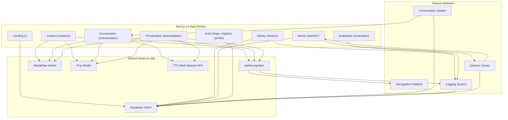
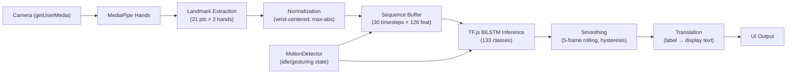
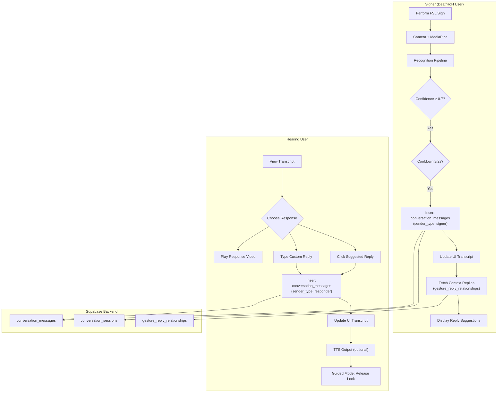
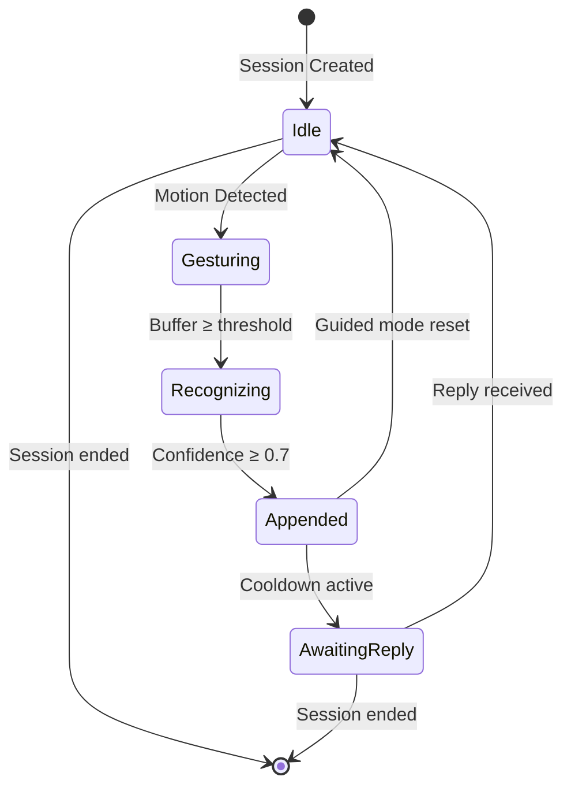
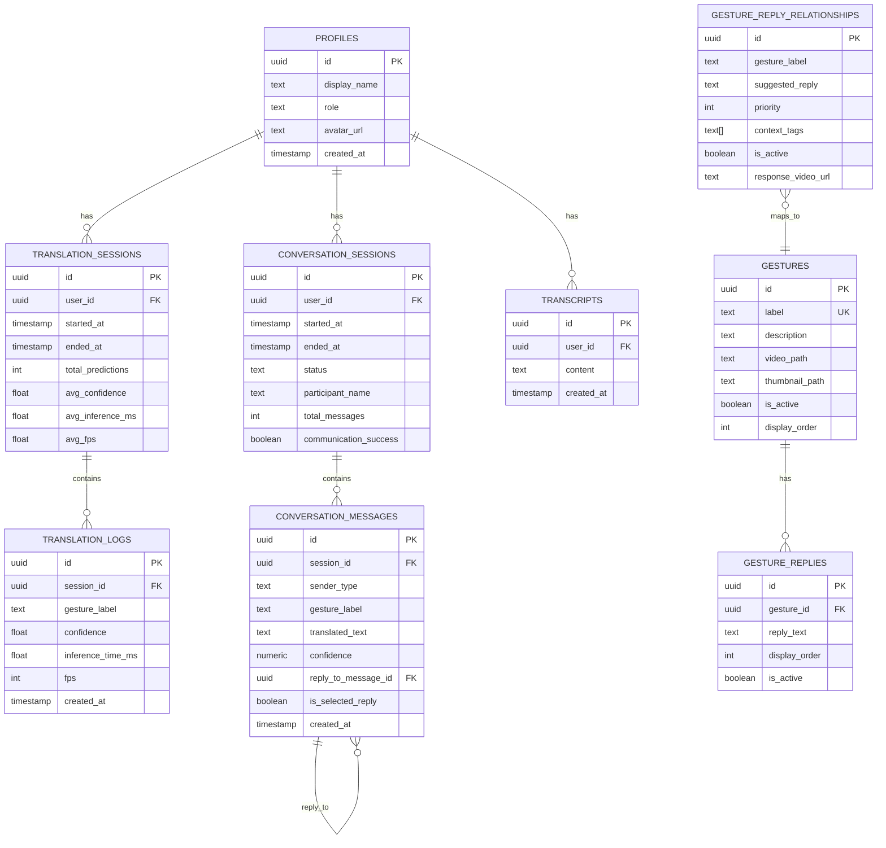
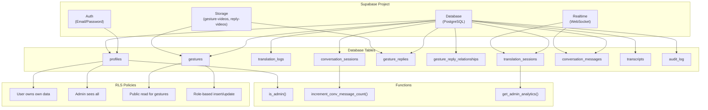
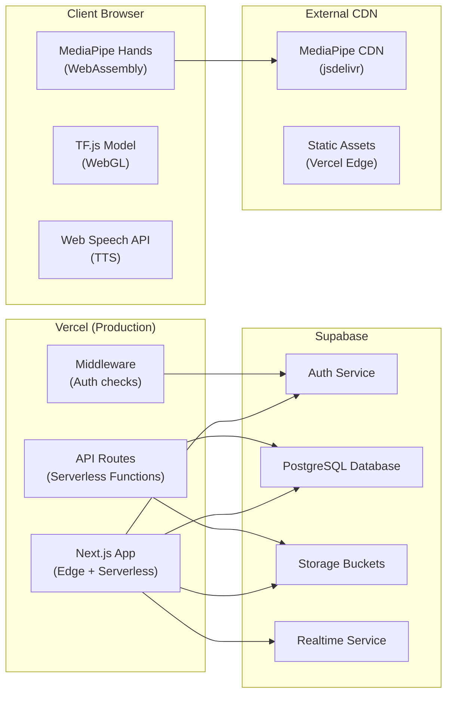
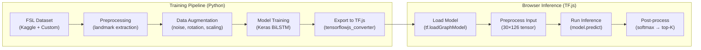

# Final System Architecture

## Overview

SignLangVisual is a browser-based Filipino Sign Language (FSL) recognition and communication platform. The entire application runs on the client side with a Supabase backend for auth, data persistence, and realtime sync.

---

## 1. Frontend Architecture



---

## 2. Recognition Pipeline



### Components

| Component | Technology | Purpose |
|-----------|-----------|---------|
| Camera | `navigator.mediaDevices.getUserMedia` | 640×480 video stream |
| Hand Tracking | `@mediapipe/hands` | 21 landmarks per hand |
| Landmark Normalization | `normalize.ts` | Wrist-centered, max-abs scaling → 126-dim vector |
| Temporal Buffer | `buffer.ts` | Ring buffer, samples 30 timesteps for model input |
| Motion Detection | `motionDetection.ts` | Inter-frame displacement analysis |
| Model Inference | TF.js (WebGL backend) | 133-class BiLSTM, loaded from `/public/models/` |
| Smoothing | `smoothing.ts` | 5-frame rolling majority vote + 0.10 hysteresis |
| Translation | `translation.ts` | DB label → human-readable display text |

---

## 3. Conversation Pipeline



### Conversation States



---

## 4. Database Schema



---

## 5. Supabase Architecture



---

## 6. Deployment Architecture



### Deployment Characteristics

| Aspect | Detail |
|--------|--------|
| **Hosting** | Vercel (Pro) |
| **Region** | Auto (nearest edge) |
| **Runtime** | Node.js 18+ |
| **Database** | Supabase (PostgreSQL 15) |
| **Auth** | Supabase Auth (GoTrue) |
| **Storage** | Supabase Storage (S3-compatible) |
| **Realtime** | Supabase Realtime (WebSocket) |
| **ML Runtime** | TensorFlow.js (browser WebGL) |
| **Hand Tracking** | MediaPipe Hands (WASM) |
| **CI/CD** | Vercel GitHub Integration |

---

## 7. AI/ML Workflow



### Model Specs

| Property | Value |
|----------|-------|
| **Architecture** | BiLSTM (Bidirectional LSTM) |
| **Input shape** | (30, 126) — 30 timesteps × 126 features |
| **Output shape** | (133,) — 133 class probabilities |
| **Total params** | ~250K |
| **Framework** | TensorFlow / Keras (Python) → TF.js (browser) |
| **Quantization** | Float32 |
| **File size** | ~2 MB (model.json + weight shards) |
| **Labels** | 27 alphabet + 106 phrases = 133 total |

---

## 8. Data Flow Summary

```
User performs sign
  → Camera captures video (30fps)
    → MediaPipe detects hand landmarks
      → Landmarks normalized (126-dim vector)
        → Appended to temporal buffer (30 frames)
          → TF.js BiLSTM inference (every 100ms)
            → Softmax → 133-class probabilities
              → Top-K extraction (K=5)
                → Prediction smoothing (5-frame rolling)
                  → Translation (label → display text)
                    → UI update (confidence, transcript)
                      → If ≥ 0.7 confidence + cooldown:
                        → Auto-append to conversation
                          → Fetch context-aware replies
                            → Hearing user sees + responds
```

---

## 9. Key Design Decisions

| Decision | Rationale |
|----------|-----------|
| **Client-side ML** | No server GPU needed; privacy (video never leaves device) |
| **Local-first storage** | Works offline; Supabase for sync + sharing |
| **MediaPipe Hands** | Mature, fast, cross-browser hand tracking |
| **TF.js WebGL backend** | GPU acceleration in browser |
| **BiLSTM over Transformer** | Smaller model size, faster inference, sufficient accuracy |
| **Supabase over Firebase** | SQL queries, PostgreSQL ecosystem, lower cost |
| **Next.js App Router** | Modern React patterns, server components, edge runtime |
| **2s cooldown** | Prevents duplicate spam during held gestures |
| **0.7 confidence threshold** | Balances accuracy vs. missed detections |
| **Context replies separate table** | Admin-manageable, not tied to model retraining |
